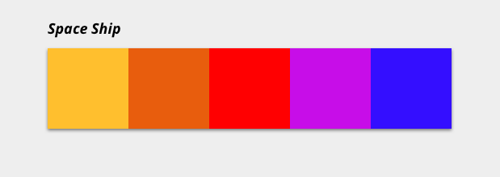

# Easley ejercicio extra
Ejercicios de fin de semana

<!-- TOC depthFrom:2 -->

- [Pautas](#pautas)
- [Ejercicios](#ejercicios)
  - [1/ Listado de noticias](#1-listado-de-noticias)
  - [2/ Marte, el planeta rojo](#2-marte-el-planeta-rojo)
  - [3/ En el espacio nadie puede oir tus fetchs](#3-en-el-espacio-nadie-puede-oir-tus-fetchs)
  - [4/ Ahora me ves...](#4-ahora-me-ves)
  - [5/ Todo es color entre tú y tus arrays...](#5-todo-es-color-entre-tú-y-tus-arrays)
  - [6/ Episodio VI: El retorno de las paletas](#6-episodio-vi-el-retorno-de-las-paletas)
  - [7/ Mis paletas preferidas](#7-mis-paletas-preferidas)
  - [8/ Buceando entre naves](#8-buceando-entre-naves)
  - [9/ ¡Caches a mi!](#9-¡caches-a-mi)

<!-- /TOC -->

## Pautas
1. Clona el repo.
2. Crea una rama con tu nombre (por ejemplo, carlos-mananas).
3. Ve haciendo los ejercicios en tu rama, cada uno en su propia carpeta.
4. Recuerda comprobar las URLs de las peticiones en **Postman** antes de comenzar a trabajar.
5. Disfruta la fruta.


## Ejercicios

### 1/ Listado de noticias
Hay que pintar en el html un listado a partir del array que tenemos en el js.
En index.html hay un ejemplo de como debe quedar cada li, con sus clases y tal para que nadie se pierda en estilos o en algo que no sea js.

### 2/ Marte, el planeta rojo
Una vez tenemos nuestra lista de noticias vamos a destacar los resultados "marcianos" aplicando la clase `.news__item--from-mars`.

Aplicaremos esta clase a los `<li>` cuyo título contenga “Mars” o “Martian”, para ello:
1. Buscaremos todos los elementos con clase `.news__item`.
2. Recorreremos la lista de elementos almacenando en una variable el contenido del título de cada elemento.
3. Usando el método `includes()` comprobaremos si contienen “Mars” o “Martian” y aplicaremos al `li`correspondiente la clase `.news__item--from-mars`
4. Tada!!

***

* [Ejemplo de .includes() en Codepen](https://codepen.io/adalab/pen/WKoLGJ?editors=1111)
* [Includes en la MDN](https://developer.mozilla.org/en-US/docs/Web/JavaScript/Reference/Global_Objects/String/includes)

***

En el archivo **css/main.css** habrá que añadir estas clases:
```css
.news__item--from-mars {
  border-color: #BC2731;
  box-shadow: 0 1px 4px rgba(188, 39, 49, 0.6);
}
.news__item--from-mars .news__title {
  color: #BC2731;
}
.news__item--from-mars .news__image {
  box-shadow: 0 0 0 3px rgba(188, 39, 49, 0.8);
  border-radius: 5px;
}
```

### 3/ En el espacio nadie puede oir tus fetchs
Todo el mundo sabe que en el espacio la comunicación es remota, así que vamos a pedir las noticias a casa. Para ello nos han dado la siguiente url:
```
https://raw.githubusercontent.com/Adalab/Easley-ejercicios-de-fin-de-semana/master/data/news.json
```
Tendremos que comentar el código anterior y volver a pintar nuestras noticias, pero esta vez las recibidas tras hacer la petición a nuestra API de noticias de casa.

### 4/ Ahora me ves...
Vamos a añadir una pequeña funcionalidad a nuestro listado de noticias: **por defecto no se van a ver las imágenes**, pero al hacer click haremos que sean visibles o vuelvan a ser invisibles... y todo cambiando **1 sola clase** que aplicaremos al contenedor general de cada noticia, el LI.

Recapitulando:
- Por defecto todos los LI tendrán una clase extra: `news__item--no-image-visible` que hará que la imagen del LI no se vea
- Al hacer click en cada noticia la quitaremos si ya la tenía o la pondremos si no la tenía de manera que al hacer click aparecerá o desaparecerá la imagen.

***

Podéis usar estos estilos:
```css
.news__item--no-image-visible .news__image {
  display: none;
}
```

### 5/ Todo es color entre tú y tus arrays...
Vamos a cambiar de tercio y sacar a la diseñadora que llevamos dentro: vamos a pintar paletas, a lo loco.

Esta vez tenemos una URL **`https://raw.githubusercontent.com/Adalab/Easley-ejercicios-de-fin-de-semana/master/data/palette.json`** que nos devuelve datos de una paleta y tenemos que pintarla como en el ejemplo:



Pero hay uno requisito:
* Podemos crear los estilos que estimemos oportunos pero el color de la paleta lo añadiremos con un atributo `style=""` en cada cuadrado, es decir, si cada cuadrado fuese un **div** podría quedar algo así:

```html
  <div class="color__item" style="background-color:#ffcc00"></div>
```
De esta manera aplicaremos el color a cada cuadrado.

### 6/ Episodio VI: El retorno de las paletas
Ahora que sabemos pintar paletas vamos a ver las paletas de las mejores naves de ciencia ficción, en esta URL **`https://raw.githubusercontent.com/Adalab/Easley-ejercicios-de-fin-de-semana/master/data/palettes.json`** tenemos a las mejores: ¡¡¡Píntalas todas!!

### 7/ Mis paletas preferidas
Una vez las tengas todas pintadas vamos a permitir que la usuaria seleccione sus paletas preferidas. Al hacer clic en cualquiera de ellas tenemos que añadirle alguna clase que la marque como seleccionada. Como hay mucha gente a la que le cuesta decidir dejaremos que marquen como preferidas tantas paletas como quieran.

### 8/ Buceando entre naves
Ahora vamos a dejar que la usuaria filtre por nombre de nave, para ello tenemos que añadir una caja de búsqueda. Cada vez que se escriba una letra filtraremos. Si la usuaria escribe 'a' solo pintaremos las naves cuyo nombre contengan 'a', si escribe 'ac' as que contengan 'ac'. Y así!

### 9/ ¡Caches a mi!
Estamos haciendo muchas peticiones al servidor cada vez que alguien visita la web. Y hemos visto que muchas veces es una usuaria que ya la visitó antes. Vamos a cachear la respuesta de nuestro fetch en localStorage.
La idea es que al cargar la página podamos consultar el LS, si ya están las paletas guardadas las pintamos directamente y nos ahorramos una petición. Sino hacemos nuestro fetch ;)


